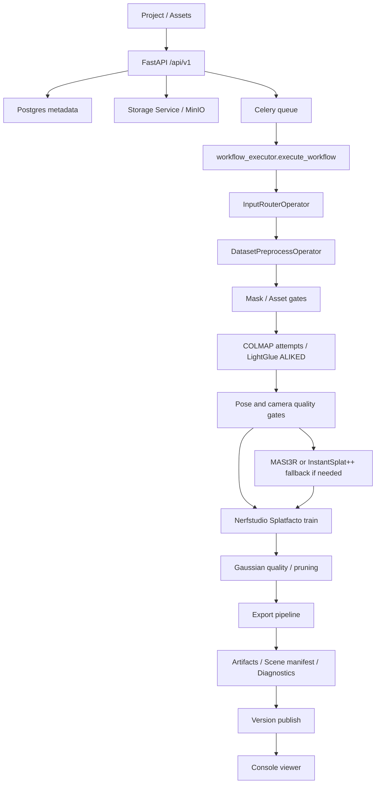

# FieldSplat 项目现状与代码结构速览

最后更新：2026-05-23

本文面向刚接手项目的人，用来快速理解 FieldSplat 当前在做什么、代码放在哪里、一次重建任务如何流转，以及改代码时应该先看哪些文件。

## 一句话定位

FieldSplat 是一个面向“第一现场数字化复原”的 Docker 化 3D/4D 重建引擎。它通过 API 和内部 React Console 接收视频、照片、全景、补拍、尺度标记等素材，调度 COLMAP、Nerfstudio Splatfacto、MASt3R SfM、InstantSplat++、语义/动态 mask、质量门禁和导出工具，最终产出可浏览的 Gaussian Splat 模型、诊断报告、制品清单和版本记录。

系统边界是 `reconstruction-api`。`reconstruction-console` 只是内部 API 客户端，不应直接读取本地文件、MinIO bucket、worker 或脚本。

## 当前实现状态

当前项目已经不是早期单视频 MVP，而是一个完整的“项目 -> 素材 -> 工作流 -> 阶段 -> 制品 -> 版本”重建任务系统：

- 后端 API：FastAPI，统一前缀为 `/api/v1`，使用 Bearer token 权限模型。
- 异步执行：Celery + Redis，按 CPU、COLMAP、GPU、Nerfstudio、export、QC 等队列调度。
- 元数据存储：PostgreSQL，记录项目、素材、任务、阶段、日志、事件、命令、制品、版本、问题。
- 对象存储：MinIO/S3 或本地存储，保存上传素材、模型、报告、viewer 资产。
- 主重建链路：素材登记、输入路由、预处理、位姿求解、质量门禁、Nerfstudio 训练、Gaussian 结构质检、剪枝、导出、发布版本。
- 兜底链路：弱 COLMAP 或少视角场景可走 MASt3R SfM / InstantSplat++ 等 fallback。
- 前端 Console：React + Vite，覆盖项目、素材、工作流监控、viewer、现场评估、建模范围、诊断、引擎状态。
- 文档：`docs/` 中保留产品、技术路线、执行计划和质量诊断记录；部分早期文档仍引用旧 MVP 路径，应以当前 `backend/`、`frontend/` 为准。

本地目录当前没有检测到 `.git`，像是项目代码快照或未在版本控制根目录打开。多人协作前需要确认实际 Git 仓库根路径。

## 运行拓扑

`docker-compose.yml` 定义基础服务，`docker-compose.gpu.yml` 追加 GPU worker。

| 服务 | 作用 | 端口/队列 |
| --- | --- | --- |
| `reconstruction-api` | FastAPI API 边界，启动时初始化数据库 | `8000` |
| `reconstruction-console` | 内部 React Console，经 Nginx 提供静态页面 | `3000` |
| `reconstruction-worker-cpu` | registry、preprocess、QC、export 等 CPU 队列 | `default,cpu,preprocess,qc,export` |
| `reconstruction-worker-colmap` | COLMAP 位姿队列 | `colmap` |
| `reconstruction-worker-nerfstudio-gpu` | Nerfstudio Splatfacto 训练，GPU 单并发 | `gpu,nerfstudio` |
| `reconstruction-worker-gpu` | InstantSplat++ / Gaussian / 语义 mask 等 GPU 队列 | `gpu,instantsplatpp,gaussian` |
| `postgres` | 业务元数据 | `5432` |
| `redis` | Celery broker/result backend | `6379` |
| `minio` | 素材和制品对象存储 | `9000/9001` |

启动命令：

```powershell
docker compose up --build
```

带 GPU worker：

```powershell
docker compose -f docker-compose.yml -f docker-compose.gpu.yml up --build
```

## 仓库目录地图

| 路径 | 作用 |
| --- | --- |
| `README.md` | 当前最短入口，说明系统边界、启动方式、核心 API、质量门禁和验证命令。 |
| `PROJECT_OVERVIEW.md` | 本文，面向交接和代码结构速览。 |
| `backend/` | FastAPI 后端、SQLAlchemy 模型、Celery workers、Operator、质量门禁和测试。 |
| `frontend/` | React/Vite 内部 Console，主要代码集中在 `src/App.tsx` 和 `src/api/client.ts`。 |
| `configs/` | 引擎配置、Operator 路径、训练参数、质量阈值、发布策略和硬性策略。 |
| `docker/` | API、worker、Nerfstudio/GPU、frontend 镜像和 GPU entrypoint。 |
| `docs/` | 产品、技术路线、执行计划、记录、归档和宣传材料。先读 `docs/00_index.md`。 |
| `models/` | 本地模型权重和动态模型缓存，例如 VGGT、SAM2、GroundingDINO、LightGlue/ALIKED。 |
| `external/` | 第三方源码和工具挂载目录，例如 InstantSplatPP、COLMAP、GroundingDINO、splat-transform。不要把这里当成一线业务代码。 |
| `workspace/` | 运行产物、缓存、调试、验证截图、锁文件。通常不应提交或作为业务源码阅读。 |
| `data/` | 本地持久化数据、样例或容器挂载数据。 |

阅读代码时优先排除这些目录：`external/`、`workspace/`、`frontend/node_modules/`、`frontend/dist/`、`__pycache__/`。

## 后端结构

后端入口在 `backend/app/main.py`：

- 创建 FastAPI app。
- 注册 CORS。
- 挂载 `/api/v1` 主路由。
- 额外挂载 `/api/capture-assessment/*` 兼容入口。
- 提供 `/ws/workflows/{workflow_id}` WebSocket，用于推送任务日志和阶段事件。

### 核心模块

| 路径 | 说明 |
| --- | --- |
| `backend/app/config.py` | Pydantic settings，读取 `.env` 和 `configs/engine.yaml`。 |
| `backend/app/database.py` | SQLAlchemy Session 和初始化。 |
| `backend/app/security.py` | Bearer token 到权限集的映射。 |
| `backend/app/api/router.py` | 聚合所有 API router。 |
| `backend/app/api/*.py` | projects、assets、workflows、artifacts、versions、groups、issues、exports、health、capture_assessment。 |
| `backend/app/models/*.py` | SQLAlchemy 数据模型。 |
| `backend/app/schemas/*.py` | API 请求/响应 schema。 |
| `backend/app/services/*.py` | 存储、制品、版本、阶段状态、日志、webhook、stage cache、资源锁。 |
| `backend/app/workers/celery_app.py` | Celery app、任务路由和本地 fallback。 |
| `backend/app/workers/workflow_executor.py` | 主工作流编排器，任务的大部分生命周期都在这里。 |
| `backend/app/operators/*.py` | 算法和工程步骤的 Operator 封装。 |
| `backend/app/operators/qc/*.py` | 位姿、相机映射、Gaussian、覆盖度、连通分量、viewer、测量等质量门禁。 |
| `backend/app/modules/*` | 现场采集评估、autopilot planner 等相对独立的业务模块。 |
| `backend/tests/` | 行为测试，覆盖 API 合同、质量门禁、operator health、fallback、默认参数、资源锁等。 |

### 核心数据模型

| 模型 | 含义 |
| --- | --- |
| `Project` | 一个现场复原工作台，持有当前版本和整体质量状态。 |
| `Asset` | 上传或登记的素材，带 `asset_type`、`role`、`area_id`、存储 URI、质量状态和元数据。 |
| `AssetGroup` | 自动或手动聚合的素材组，用于区域、批次或输入分组。 |
| `Workflow` | 一次建模/预检/对比/导出任务，记录输入、配置、状态、进度和质量结果。 |
| `WorkflowStage` | 面向用户可观察的阶段清单，集中定义在 `workflow_state_service.py` 的 `STAGE_MANIFEST`。 |
| `WorkflowLog` / `WorkflowEvent` | 日志流和事件流，供 API、WebSocket、前端监控使用。 |
| `CommandRecord` | 外部命令执行记录，保留命令、cwd、stdout/stderr 尾部、耗时和退出码。 |
| `Artifact` | 每个阶段产出的文件或 JSON 制品，带类型、阶段、大小、预览/下载信息。 |
| `Version` | 可发布或激活的模型版本，关联 workflow 和 artifact。 |
| `QualityReport` | 工作流质量报告。 |
| `Issue` / `Supplement` | 补拍、缺陷、局部融合等后续问题管理。 |

## 主工作流

新建任务入口主要是：

- `POST /api/v1/projects/{project_id}/workflows`
- `POST /api/v1/projects/{project_id}/auto-reconstruction`

API 创建 `Workflow` 后，调用 `execute_workflow.apply_async(...)` 投递到合适队列。`workflow_executor.py` 读取素材和配置，再按 workflow 类型选择执行路径。



典型重建阶段来自 `STAGE_MANIFEST`，按大类可理解为：

1. 素材和输入：`asset_register`、`capture_assessment`、`input_classify`、`scene_profile`、`autopilot_plan`、`input_route`。
2. 预处理和范围：`preprocess`、`subject_mask_generation`、`dynamic_mask_gate`、`spatial_crop`。
3. 位姿和质量：`pose_lightglue_aliked_matching`、`pose_colmap_attempts`、`colmap_global_skeleton`、`colmap_quality_gate`、`camera_quality_gate`、`coverage_gate`、`connected_component_gate`、`pointcloud_fragmentation_gate`。
4. 兜底和训练：`pose_mast3r_sfm_fallback`、`instantsplatpp_init`、`camera_mapping_gate`、`instantsplatpp_train`、`splatfacto_train`、`export_gaussian_splat`。
5. 高斯和发布：`gaussian_quality_gate`、`gaussian_pruning`、`render_quality_gate`、`viewer_load_gate`、`measurement_gate`、`artifact_register`、`export_*`、`quality_gate`、`version_publish`、`final_report`、`cleanup`。

质量门禁会阻断 D-grade 或 hard-fail 结果。这类结果不能创建 current version，也不能作为正式 viewer 发布。

## Operator 体系

Operator 是外部算法和工程步骤的边界。API 不直接跑长任务，只创建元数据和队列任务；worker 在 workspace 中运行 Operator，然后把输出注册成 Artifact。

| Operator 文件 | 主要职责 |
| --- | --- |
| `operators/input_router.py` | 按素材类型和角色分桶，选择 `colmap_splatfacto`、`colmap_chunked_splatfacto`、`mast3r_sfm_splatfacto`、`instantsplatpp_sparse_local`、`pano_anchor_export` 等路线。 |
| `operators/preprocess.py` | 素材检查、视频抽帧、全景裁剪、动态 mask、数据集准备、stage cache。 |
| `operators/pose.py` | COLMAP 多尝试、MASt3R SfM fallback、transforms/camera trajectory/sparse point cloud 输出。 |
| `operators/feature_matching.py` | LightGlue/ALIKED 预匹配。 |
| `operators/colmap.py` | COLMAP global skeleton 和质量提取。 |
| `operators/nerfstudio.py` | Nerfstudio Splatfacto/Splatfacto-W 训练、导出、评估和缓存。 |
| `operators/instantsplatpp.py` | InstantSplat++ 初始化、训练、相机映射解析。 |
| `operators/scope.py` | 主体 mask、空间裁剪、Gaussian pruning、前景/上下文模型输出。 |
| `operators/scene.py` | 大场景分块判断。 |
| `operators/repair.py` | 位姿和点云异常后的修复策略。 |
| `operators/export.py` | raw PLY、优化 viewer asset、SPZ、3D Tiles、scene manifest、diagnostics bundle。 |
| `operators/forensic_quality_boost.py` | 取证/现场复原质量增强主线。 |
| `operators/qc/*.py` | 各类质量门禁和评分。 |

Operator 可用性通过 `/api/v1/health/operators` 暴露，依赖路径来自 `configs/engine.yaml`。

## API 速览

基础前缀：`/api/v1`

认证：所有外部调用使用：

```text
Authorization: Bearer <token>
```

常用 API：

| API | 用途 |
| --- | --- |
| `GET /health` | API、数据库、存储等健康状态。 |
| `GET /health/operators` | 外部算法、模型权重、工具路径可用性。 |
| `GET /health/workers` | Celery worker 状态。 |
| `POST /projects` / `GET /projects` | 创建和列出项目。 |
| `POST /projects/{project_id}/assets/upload` | 上传素材。 |
| `POST /projects/{project_id}/assets/register` | 从白名单 host import 路径登记素材。 |
| `GET /projects/{project_id}/assets` | 项目素材列表。 |
| `POST /projects/{project_id}/groups/auto` | 自动分组素材。 |
| `POST /projects/{project_id}/workflows` | 按指定配置创建工作流。 |
| `POST /projects/{project_id}/auto-reconstruction` | 自动选择素材批次和默认配置启动重建。 |
| `GET /workflows/{workflow_id}` | 工作流快照，含阶段、质量、制品。 |
| `GET /workflows/{workflow_id}/logs` | 工作流日志。 |
| `GET /workflows/{workflow_id}/events` | 工作流事件。 |
| `GET /workflows/{workflow_id}/artifacts` | 工作流制品列表。 |
| `GET /workflows/{workflow_id}/viewer` | 工作流 viewer 状态。 |
| `POST /workflows/{workflow_id}/cancel` | 取消任务。 |
| `POST /workflows/{workflow_id}/rerun` | 复跑任务。 |
| `GET /projects/{project_id}/versions` | 项目版本列表。 |
| `GET /versions/{version_id}/viewer` | 版本 viewer 数据。 |
| `GET /diagnostics/{workflow_id}` | 诊断页数据，含阶段、命令、质量、制品。 |
| `POST /capture-assessment/run` | 现场素材评估。该 router 同时存在 `/api/v1/capture-assessment/*` 和 `/api/capture-assessment/*` 入口。 |

## 前端结构

前端是内部 Console，不是对外产品官网。

| 路径 | 说明 |
| --- | --- |
| `frontend/src/main.tsx` | React 入口。 |
| `frontend/src/App.tsx` | 主要页面、路由、组件、viewer、监控面板、现场评估等都集中在这里。文件很大，改动时要控制范围。 |
| `frontend/src/api/client.ts` | API 类型、token、请求封装、全部后端接口方法。 |
| `frontend/src/styles/app.css` | Console 样式。 |
| `frontend/public/config.js` | 运行时配置注入。 |
| `frontend/package.json` | Vite/React/Three/SparkJS 依赖和构建脚本。 |

前端路由主要包括：

- `/projects`
- `/field-assessment`
- `/reconstruction-scope`
- `/projects/:projectId`
- `/projects/:projectId/assets`
- `/projects/:projectId/workflows`
- `/workflows/:workflowId/monitor`
- `/versions/:versionId/viewer`
- `/projects/:projectId/issues`
- `/diagnostics/:workflowId`
- `/admin/engine`

viewer 主要使用 `three` 和 `@sparkjsdev/spark`，支持 Gaussian PLY / Spark 预览，并尝试根据注册相机视角定位预览相机。

## 配置和策略

| 文件 | 作用 |
| --- | --- |
| `.env.example` | 本地开发默认环境变量和 token 示例。对外暴露前必须替换。 |
| `configs/engine.yaml` | 主要引擎配置：存储、数据库、Redis、Operator 路径、训练模式、质量阈值、发布策略、FieldSplat 默认链路。 |
| `configs/engine_policy.yaml` | 硬性策略：禁止混合原始图片数据集、禁止低质结果作为最终产品、要求 scene manifest/diagnostics/viewer asset 等。 |
| `docker-compose.yml` | API、基础 worker、Postgres、Redis、MinIO、Console。 |
| `docker-compose.gpu.yml` | GPU/Nerfstudio/InstantSplat++ worker。 |

开发时最常见的本地开关在 `backend/app/config.py`：

- `COLMAP_FAKE_RUNNER`
- `NERFSTUDIO_FAKE_RUNNER`
- `CELERY_TASK_ALWAYS_EAGER`
- `HOST_IMPORT_ROOT`
- `ASSET_IMPORT_ROOTS`
- `WORKSPACE_ROOT`

实际变量名大小写由 Pydantic settings 支持，不区分大小写。

## 重要制品

每次完整工作流通常会产出：

- `dataset_manifest.json`
- `input_routing_manifest.json`
- `registration_report.json`
- `transforms.json`
- `camera_trajectory.json`
- `sparse_point_cloud.ply`
- Gaussian PLY / raw PLY
- optimized viewer asset / SPZ / 3D Tiles
- `scene_manifest.json`
- `diagnostics_bundle.json`
- `quality_report.json`
- `run_summary.json`
- `artifacts.json`
- `stage_timing` 类报告

制品由 `ArtifactService` 注册到数据库，并通过 API 返回下载、预览或 viewer URL。

## 新人阅读顺序

建议按这个顺序读：

1. `README.md`：确认系统边界、启动、API 最小闭环和验证命令。
2. 本文：建立项目和代码结构地图。
3. `docs/00_index.md`：进入业务、技术路线和执行计划文档。
4. `configs/engine.yaml`：理解当前 Operator、阈值、训练模式和发布策略。
5. `backend/app/services/workflow_state_service.py`：理解用户能看到的阶段清单。
6. `backend/app/workers/workflow_executor.py`：理解任务编排。
7. `backend/app/operators/input_router.py`、`preprocess.py`、`pose.py`、`nerfstudio.py`、`export.py`：理解主链路。
8. `backend/app/api/workflows.py` 和 `frontend/src/api/client.ts`：理解前后端合同。
9. `frontend/src/App.tsx`：理解 Console 页面和状态流。
10. `backend/tests/`：看当前行为保护边界。

## 常见改动入口

| 需求 | 先看哪里 |
| --- | --- |
| 新增 API | `backend/app/api/`、`backend/app/schemas/`、`backend/app/api/router.py`、对应测试。 |
| 新增数据库字段 | `backend/app/models/`、schema、API 读写逻辑。当前未看到迁移工具，需确认数据库升级方式。 |
| 新增工作流阶段 | `workflow_state_service.py` 的 `STAGE_MANIFEST`、`workflow_executor.py` 更新点、前端阶段展示文案。 |
| 新增 Operator | `backend/app/operators/`、`configs/engine.yaml`、`celery_app.py` task route、`operators/registry.py` health、测试。 |
| 调整质量门禁 | `backend/app/operators/qc/`、`configs/engine.yaml` quality/fieldsplat defaults、对应 `backend/tests/test_*gate*.py`。 |
| 调整输入路由 | `backend/app/operators/input_router.py` 和 `configs/engine.yaml` 中 route selection 默认项。 |
| 调整训练参数 | `configs/engine.yaml` 的 `training.nerfstudio_splatfacto` 和 `backend/app/operators/nerfstudio.py`。 |
| 调整导出格式 | `backend/app/operators/export.py`、`configs/engine.yaml` 的 `operators.export`、前端 artifact/viewer 逻辑。 |
| 改 Console 页面 | `frontend/src/App.tsx`、`frontend/src/api/client.ts`、`frontend/src/styles/app.css`。 |
| 排查任务失败 | `/diagnostics/{workflow_id}`、`CommandRecord`、`WorkflowStage.error_message`、`workspace/runs/...`。 |

## 验证命令

后端测试：

```powershell
cd backend
python -m pytest
```

前端构建：

```powershell
cd frontend
npm install
npm run build
```

Docker 配置校验：

```powershell
docker compose -f docker-compose.yml -f docker-compose.gpu.yml config --quiet
```

基础启动：

```powershell
docker compose up --build
```

## 当前接手注意点

- `external/`、`models/`、`workspace/` 体积和噪声都很大，读代码和搜文件时先排除。
- `frontend/src/App.tsx` 是一个超大单文件，包含路由、页面、viewer 和大量展示逻辑。小改动要局部处理，较大前端改造应先拆组件再验证。
- `workflow_executor.py` 同样很大，是主编排器。改任务链路前先确认阶段清单、质量门禁、制品注册、版本发布和异常路径。
- `configs/engine.yaml` 是行为配置中心。很多看似代码问题实际是配置、挂载路径、模型权重或 worker 队列不可用。
- 质量门禁是产品边界，不只是测试辅助。D-grade 或 hard-fail 不应被绕过发布。
- `README.md` 中强调默认开发 token 只适合本地网络，暴露 API 前必须替换 `.env` 中 token 和对象存储凭据。
- `docs/03_execution_plans/` 和部分旧文档记录了早期 MVP 的演进，里面的旧路径不一定对应当前代码结构。
- 当前本地目录不是 Git 仓库；提交、分支和协作流程要先确认真实仓库位置。
